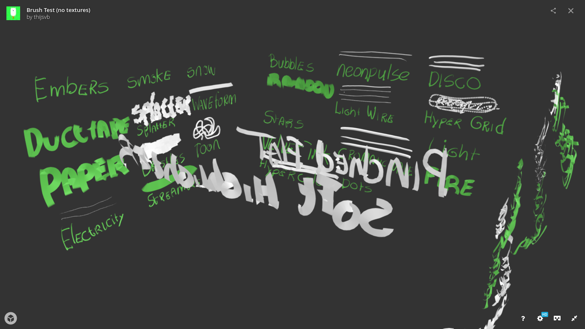
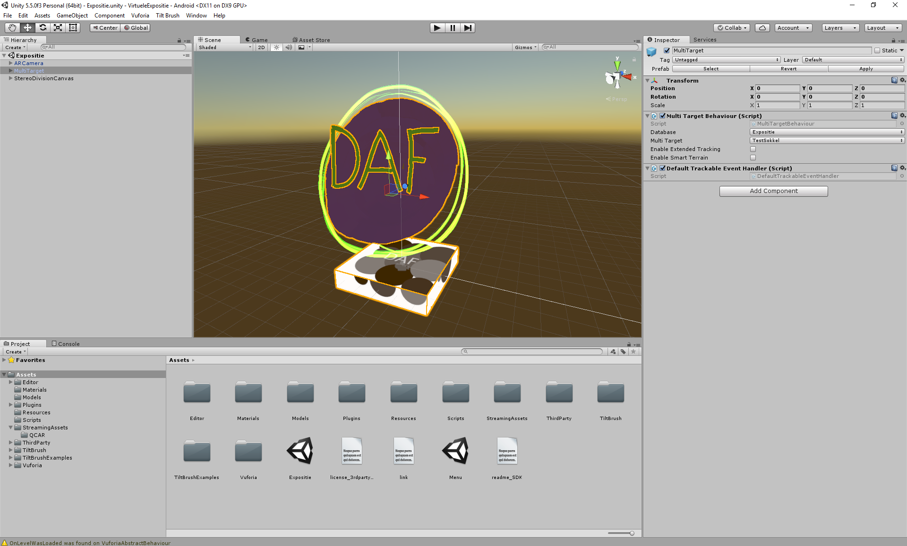
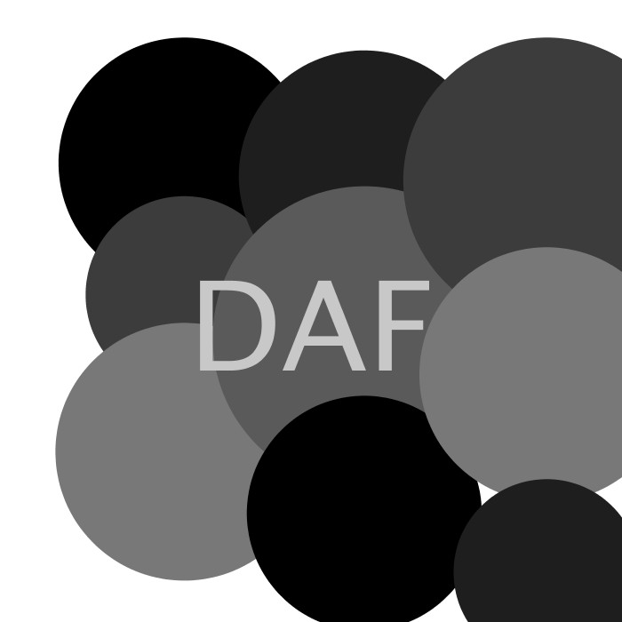

# App Documentation
This is a documentation of the process of making the Virtual Exposition app.

## Displaying Tilt Brush Sketches
Since the entire point of this project is to display Tilt Brush sketches,
I started out by looking at ways they could be exported from Tilt Brush.

What I found is that exporting the shapes is fairly easy, either as `.fbx` or `.obj` files.
However, these files lose all texture and color information.
There are ways around this, since Tilt Brush also offers all the textures used in a sketch.
By using 3D graphics software like *Houdini* colors and textures can be added by hand.

Later Google released their Tilt Brush Unity Toolkit, which can export sketches from Tilt Brush into Unity with all colors and textures.
This means the imported model in Unity looks exactly like it was created in Tilt Brush.
Because I was already making the app in Unity, I decided to use this.

*An exported Tilt Brush sketch in the online viewer Sketchfab*

More detailed documentation on various ways of exporting Tilt Brush sketches I tried out can be found in [this repository](http://github.com/thijsvb/TiltBrushDisplay).

## Using the Vuforia AR Platform
To make the models appear on empty pedestals I used the Vuforia AR platform for Unity.

Vuforia can recognise various types of targets; images, cuboids, cylinders and 3D objects.
For an image target it just needs an image. For a cuboid target it needs the dimensions of the cube and an image for each of the faces. For a cylinder target it needs the dimensions and an image to wrap around the cylinder, as well as an image for both the top and the bottom. Finally, for the 3D object target you have to scan an object using an app Vuforia made.

I registered at Vuforia to get a license key and created a database. To this database I could add targets and upload the images. I tried out all of the targets and decided that the cuboid would be best for tracking the top of a pedestal.

In Unity I imported the Vuforia package and the Tilt Brush Toolkit package. I then imported the target database and the Tilt Brush sketch. In Unity I placed the model on the target and positioned it to look right. After adjusting some settings for Android, this was a working AR app.

Vuforia can also be compatible with a (Google Cardboard style) VR viewer by changing some settings. However, because the point of view is the camera which is at an odd offset and the field of view is small, it's not the best VR experience.

*A cuboid target with a model on top in Unity*

More detailed documentation on the different Vuforia targets can be found in [this repository](http://github.com/thijsvb/VuforiaTest).

## Making the Pattern Generator
After testing a lot of stuff in Vuforia, I learned what kind of target images worked best. Vuforia puts tracking points on an image, these points are placed on corners with a lot of contrast. So anything that has enough contrasting colors and corners will be a good tracking image. Text works really well for this purpose.

I made a pattern generator to create the target images for the pedestals. The pedestals will be square coloms, with the top part having a pattern on it. This top slice of the pedestal can be seen as a cuboid, so the pattern generator makes images that can be used for a cuboid target.

When running the pattern generator you first have to enter a name for the artwork. This name will act as a unique identifier for the piece. By using the name to seed a random number generator, entering the same name will always generate the same pattern. The pattern itself is a couple of greyscale circles overlapping each other, with the name printed over that on the top image.

*An example of the top of a generated cuboid target*

## Final Product
In the final app I combined all the research listed above. I also added a simple menu at the start, which lets you choose between using the app handheld or with a VR viewer.
