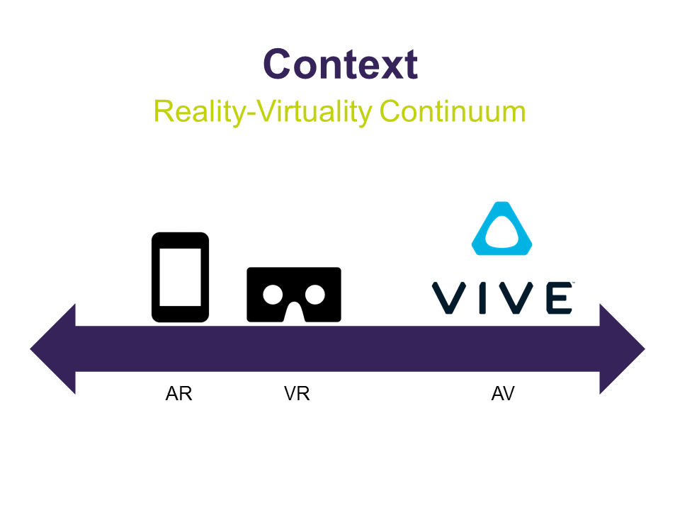
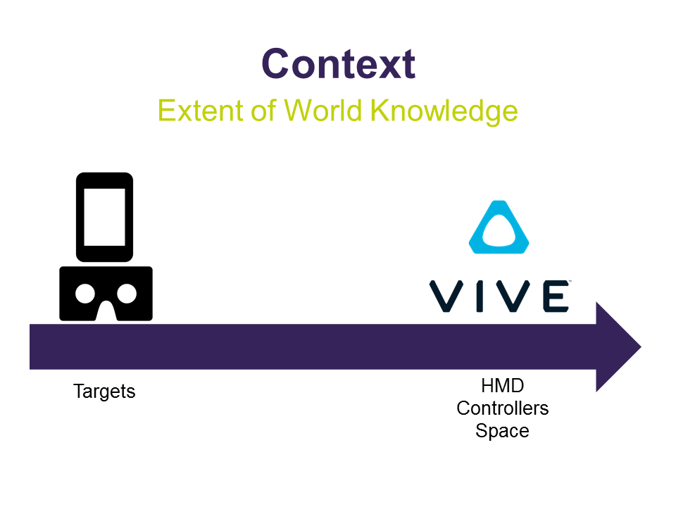
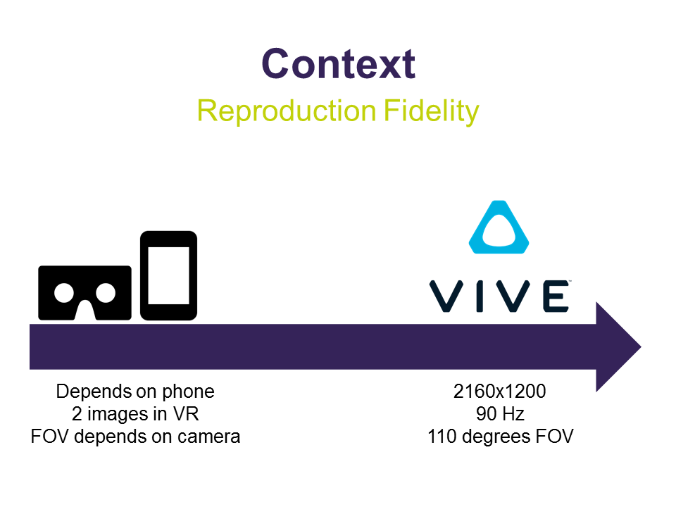
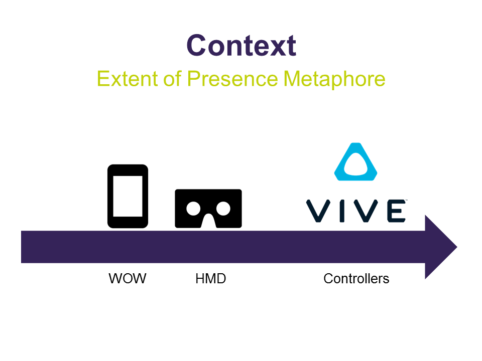

# Virtual Exposition in Mixed Reality context
In this documentation I’ll be placing the technologies used in the Virtual Exposition in the field of Mixed Reality. To do this I’ll use the taxonomy as defined by Paul Milgram, Haruo Takemura, Akira Utsumi and Fumio Kishino in [*Augmented Reality: A class of displays on the reality-virtuality continuum*](http://etclab.mie.utoronto.ca/publication/1994/Milgram_Takemura_SPIE1994.pdf). I’ll start with a short summary of that taxonomy. 

## Reality-Virtuality Continuum
The RV Continuum is a scale between a real and a virtual environment.

## Extent of World Knowledge (EWK)
The EWK is a measure of how aware the device is of its environment. It is derived by looking at whether a device knows what the object around him are and whether it knows where those objects and itself are in 3D space.

## Reproduction Fidelity (RF)
The RF is a measure of quality of the image the device creates. This depends on resolution, field of view and whether the image is mono- or stereoscopic.

## Extent of Presence Metaphor (EPM)
The EPM is a measure of immersion. It is partly dependent on the RF, as a better quality image will result in a more immersive experience. It also depends on whether the device uses a screen or a HMD (Head Mounted Device) and how much motion tracking there it does.

## Virtual Exposition
First I’ll be rating the Virtual Exposition on these four criteria. Since there are the options in the AR app to use it handheld or in a VR headset, I’ll rate those separately.

The handheld version is a clear example of AR, since it adds an image to reality. When using the app in a VR viewer it can be concidered closer to VR. This is because it augments the entire field of view, so you're placed in a different reality.

For both options the EWK is the same. It’s quite low, because the app only recognizes the targets. But apart from knowing where the targets and the models are in relation to each other, it has no model of any other objects or even itself in 3D space.

The RF for the handheld option will be slightly higher, because the image can be displayed on the entire screen. The VR option displays the image twice on the same screen and because of that has a lower resolution. However, the RF is mostly dependent on the type of phone the app is running on. The higher the resolution of the screen and camera on the phone are, the higher the RF will be.

The EPM will be reasonable for both options, since there is a Video See-Through view. The VR option, however, will be slightly more immersive, because it uses a HMD. But the field of view is smaller than in other VR apps, because it depends on the field of view of the camera.

## HTC Vive
I’ll also be taking a look at the HTC Vive, specifically the program Tilt Brush by Google, since that’s what was used to make the art for the Virtual Exposition.

The Vive is more of an augmented virtual environment, since most of the world around you is Computer Generated. The only real elements are the size of the environment and the tracked HMD and controllers.

The EWK is very high for the Vive, it knows what the controllers and headset are and where they are in relation to the room (actually the base stations). 

The RF is also very high, as the Vive has a good resolution (2160x1200 at 90Hz), stereoscopic view and a field of view of 110 degrees.

Also the EPM is very good for the Vive, the HMD and motion tracking of both the head and controllers results in a very immersive experience.

## Graphs
I made some graphs to illustrate the differences between the Vive and the handheld and VR versions of the AR app.

